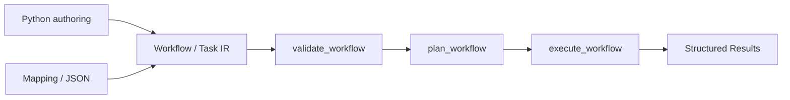

# P6 UX and composition evaluation

## Decision

Select the canonical Python API as the first UX surface for the current increment. The existing public API already exposes authoring (`Workflow`, `Task`, `ProcessSpec`), validation (`validate_workflow`), planning (`plan_workflow`), and execution (`execute_workflow`). A standalone CLI or YAML loader would add another input surface without a demonstrated user requirement or an agreed command/configuration contract.

This is a scope decision, not a claim that CLI/YAML are permanently excluded. They can be added later as thin adapters that normalize into the existing `Workflow` IR and call the existing runtime.

## User-facing flow

The example in `samples/workflow_ir_sample.py` exercises this path end-to-end. It uses a data-oriented `ProcessSpec`, so it is executable without optional remote/container infrastructure.

## Application and artifact composition

Keep application composition outside the execution kernel for now. Applications can compose existing workflows in Python and call the same validation/planning/execution functions. Artifact creation, packaging, and publication should remain separate consumers of structured results until a concrete artifact contract is approved.

No generic application container, artifact registry, persistence layer, or second workflow engine is introduced in P6. The existing `Result` is sufficient for the current local vertical slice; artifact lifecycle and cross-process transfer remain future work requiring concrete requirements.

## Dependency and compatibility review

- The Python workflow example uses only the standard library and Marsh's existing API.
- No runtime or optional dependency was added.
- Existing Conveyor, DAG, SSH, Docker, and Python executor APIs are unchanged.
- The Python API remains the selected adapter; YAML/CLI are not represented as implemented capabilities.

## Acceptance checks

- The example validates, plans, and executes through one canonical IR/runtime path.
- The example is covered by a pytest end-to-end test.
- README documents the API and its current limitations.
- No new required dependency or alternate execution engine is introduced.
