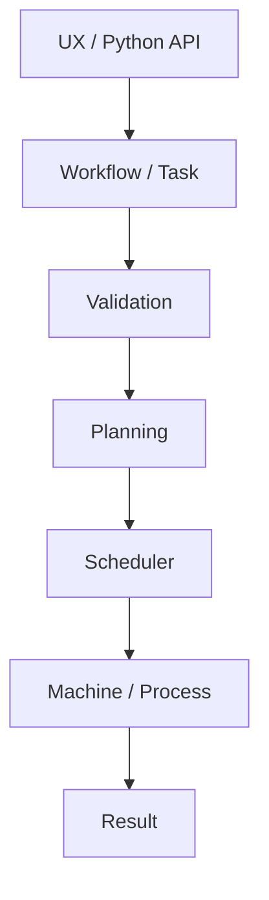
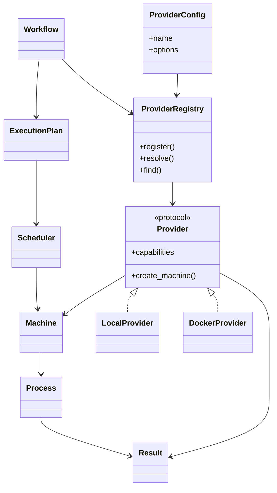

# Marsh Architecture

## Architecture

Marsh is moving toward a small execution kernel with explicit boundaries:



The architectural goal is to keep:

- workflow intent;
- execution mechanisms;
- machines;
- processes;
- scheduling;
- policies;
- providers;
- observability; and
- results

as distinct concepts.

The existing command and DAG APIs remain useful low-level building blocks and compatibility surfaces.

## Implementation status

This document describes the architecture implemented by the current Alpha release. Future capabilities are described only as extension boundaries and are not presented as implemented features.


## Provider boundary (v0.3.4)

Providers are execution-mechanism adapters. Workflow intent, planning, scheduling, and policy semantics remain provider-independent.



Runtime resolution is deliberately outside the Workflow IR:

```text
execute_workflow(workflow, provider=config)
    -> resolve config.name in ProviderRegistry
    -> verify required capabilities
    -> materialize Provider Machine
    -> run the existing Scheduler
    -> return the existing Result model
```

A new backend should therefore add a Provider/Adapter and conformance tests rather than introduce provider-specific branching into Workflow or planning.
