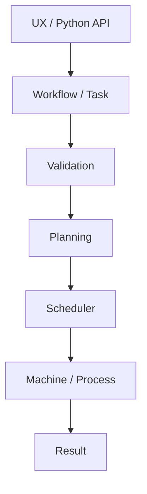

# Marsh Architecture

## Architecture

Marsh is moving toward a small execution kernel with explicit boundaries:

The architectural goal is to keep:

- workflow intent;
- execution mechanisms;
- machines;
- processes;
- scheduling;
- policies;
- providers;
- observability; and
- results

as distinct concepts.

The existing command and DAG APIs remain useful low-level building blocks and compatibility surfaces.

## Implementation status

This document describes the architecture implemented by the current Alpha release. Future capabilities are described only as extension boundaries and are not presented as implemented features.
