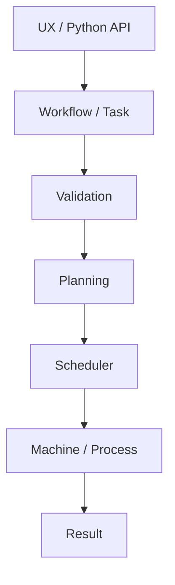
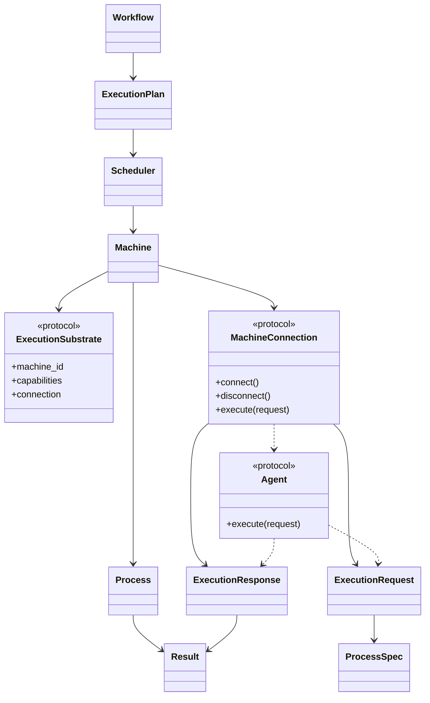
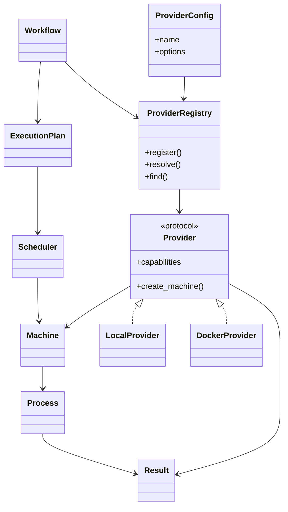
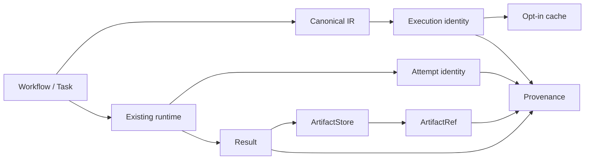

# Marsh Architecture

## Architecture

Marsh is moving toward a small execution kernel with explicit boundaries:



The architectural goal is to keep:

- workflow intent;
- execution mechanisms;
- machines;
- processes;
- scheduling;
- policies;
- providers;
- observability; and
- results

as distinct concepts.

The existing command and DAG APIs remain useful low-level building blocks and compatibility surfaces.

## Implementation status

This document describes the architecture implemented by the current Alpha release. Future capabilities are described only as extension boundaries and are not presented as implemented features.

### Remote execution boundary (v0.4.1)

v0.4.1 adds a transport-neutral boundary without introducing a second runtime or selecting a production distributed transport.



Semantic flow:

```text
Workflow / Task
    -> canonical execution identity
    -> attempt identity
    -> ExecutionRequest
    -> MachineConnection
    -> optional Agent / ExecutionSubstrate
    -> Process
    -> Result
    -> ExecutionResponse

Transport failure
    -> authoritative result available?
        yes -> reconcile to observed result
        no  -> preserve ambiguous state
```

The current `SocketMachineConnection` is a small reference/conformance adapter. It deliberately does not define Marsh production transport architecture.

### Scheduler state machine (v0.3.5)

The canonical runtime now uses one shared scheduler state model across sequential and bounded-concurrency modes:

```text
READY -> RUNNING -> SUCCEEDED
                 -> FAILED
                 -> CANCELLED
READY -> BLOCKED
```

Dependency readiness is defined by `all(dependency == SUCCEEDED)`. Failed, cancelled, or blocked dependencies prevent downstream dispatch. Concurrent modes use a deterministic ready ordering and a hard `max_concurrency` bound.

The scheduler owns readiness and dispatch policy; Machine/Process/Provider components own execution. Process-mode execution crosses the process boundary only with serializable task state, dependency results, and a picklable execution callback.

```text
Workflow
  |
  v
Validation / graphlib planning
  |
  v
Scheduler state machine
  |---- READY tasks ----> bounded dispatch ----> execution
  |                                             |
  +<------------- Result / state ---------------+
```


## Canonical Workflow IR (v0.3.6)

The canonical workflow boundary is versioned independently from the package release:

```text
Authoring
   |
   v
Configuration
   |
   v
marsh.workflow/v1
   |
   +--> deterministic JSON
   |
   v
Reconstruction
   |
   v
Existing Runtime / Scheduler
```

The IR is provider-independent and does not introduce a second execution model. Workflow and task IDs are semantic identities; executable Python callables are represented by explicit `OperationRef` values rather than arbitrary live object state. Unsupported runtime values fail explicitly at the boundary.

## Provider boundary (v0.3.4)

Providers are execution-mechanism adapters. Workflow intent, planning, scheduling, and policy semantics remain provider-independent.



Runtime resolution is deliberately outside the Workflow IR:

```text
execute_workflow(workflow, provider=config)
    -> resolve config.name in ProviderRegistry
    -> verify required capabilities
    -> materialize Provider Machine
    -> run the existing Scheduler
    -> return the existing Result model
```

A new backend should therefore add a Provider/Adapter and conformance tests rather than introduce provider-specific branching into Workflow or planning.


## Runtime policy control (v0.3.7)

Policies are declarative inputs to one backend-independent runtime-control boundary. The policy layer decides semantics; schedulers, providers, machines, and processes implement mechanisms.

Policy flow: Workflow/Task -> Policy configuration -> Policy evaluator -> effective timeout / attempt identity / terminal outcome arbitration / cleanup decision / retry decision -> Scheduler/Provider/Process -> Result and lifecycle events.

The attempt lifecycle is: execute -> terminal outcome -> cleanup at most once -> retry decision -> either a new attempt identity or final outcome.

Cancellation is a request followed by mechanism-specific stop/terminate/kill and confirmation. A cancellation request is not itself a confirmed CANCELLED result. Timeout cleanup completes before retry eligibility is evaluated.

The policy evaluator is pure and inspectable. Backend differences must not change the policy decision for the same policy, task metadata, outcome, and control history. Runtime-only callbacks such as cleanup functions remain outside the portable IR serialization boundary.


## Artifact and identity boundary (v0.3.8)

v0.3.8 extends the existing canonical Workflow IR and runtime rather than introducing a second execution engine.



Plaintext contract:

```text
Workflow semantics
    -> canonical UTF-8 representation
    -> execution identity

Existing scheduler / policy / provider path
    -> attempt identity
    -> Result

Result bytes
    -> SHA-256 content identity
    -> local ArtifactStore (optional)
    -> ArtifactRef

Execution identity != attempt identity != artifact identity

Provenance is allow-listed and serializable.
Storage paths and runtime objects are not semantic identity.
```

### Identity layers

- Execution identity: semantic fingerprint of a portable workflow execution.
- Attempt identity: per-attempt runtime identity; retries receive distinct attempt IDs.
- Artifact identity: SHA-256 of artifact bytes; independent of storage location.
- Result: semantic outcome that may reference artifacts and provenance.

### ArtifactStore boundary

ArtifactStore is a narrow capability. LocalArtifactStore uses content-addressed paths, manifests, digest/size verification, secure temporary files, and atomic finalization. Remote object stores are not required by the canonical runtime.

### Compatibility boundary

Legacy callable workflows remain executable. When their definitions cannot be represented by the portable canonical IR, runtime identity is unavailable rather than fabricated from process-local object representations.

The runtime accepts an optional ArtifactStore. Without one, existing result streams remain in memory and no artifact directory is required.

### Security boundary

Portable provenance is allow-listed. It must not contain credentials, full environment dumps, arbitrary runtime objects, or storage implementation details. Artifact reads verify content identity and declared size before returning bytes.
