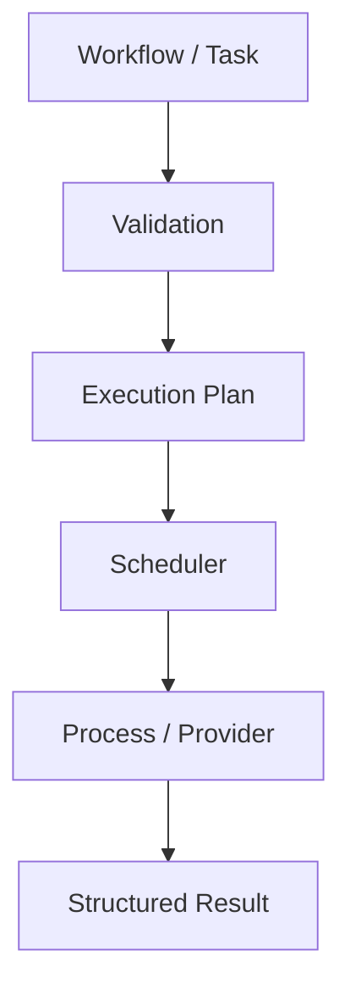

# Marsh Workflow Guide

This guide is the dependency-free Markdown entry point for the canonical Marsh Workflow API.

## 1. The canonical flow

A workflow follows a deliberate lifecycle:

```text
Workflow definition
      |
      v
Validation
      |
      v
Execution plan
      |
      v
Scheduler
      |
      v
Process / provider execution
      |
      v
Structured Result objects
```

The public API separates **what work means** from **how work is executed**:

- `Workflow` and `Task` describe workflow intent.
- `ProcessSpec` describes an executable process.
- Validation rejects malformed workflow structure before execution.
- Planning exposes deterministic execution order and readiness.
- The scheduler controls execution order.
- Providers/executors perform the actual work.
- `Result` records execution outcome and diagnostics.

The canonical runtime remains local, with sequential and bounded-concurrency scheduler modes available through the public runtime APIs. Existing SSH, Docker, Python, command-composition, and DAG APIs remain compatibility surfaces.

See [the architecture overview](../concepts/architecture.md) for the implemented boundaries.

## 2. Minimal workflow

The smallest useful workflow uses `Workflow`, `Task`, and `ProcessSpec`:

```python
import sys

from marsh import ProcessSpec, Task, Workflow, execute_workflow

workflow = Workflow(
    id="hello",
    tasks=(
        Task(
            id="greet",
            operation=ProcessSpec(
                executable=sys.executable,
                arguments=("-c", "print('hello from Marsh')"),
            ),
        ),
    ),
)

results = execute_workflow(workflow)
result = results["greet"]

if not result.ok:
    raise RuntimeError(result.error)

print(result.stdout.decode().strip())
```

The repository version of this example is [`samples/workflow_basic.py`](../../samples/workflow_basic.py).

## 3. Validate before executing

Validation is an explicit boundary:

```python
from marsh import validate_workflow

order = validate_workflow(workflow)
print(order)
```

Validation covers the workflow structure and dependency semantics, including:

- task identifier validity;
- dependency references; and
- dependency cycles.

Validation is deterministic. Applications can therefore reject an invalid definition before starting execution.

The planning example is [`samples/workflow_plan.py`](../samples/workflow_plan.py).

## 4. Inspect the execution plan

Use `plan_workflow()` when an application needs to inspect execution without starting it:

```python
from marsh import plan_workflow

plan = plan_workflow(workflow)

print(plan.order)
print(plan.ready)
```

The execution plan is the canonical bridge between workflow semantics and scheduling. The intent is:

```text
Workflow
   |
   v
canonical execution plan
   |
   v
scheduler
```

This avoids creating a second independent dependency engine.

## 5. Dependencies and failure propagation

Tasks declare dependencies explicitly:

```python
Task(
    id="test",
    operation=...,
    dependencies=("build",),
)
```

For a simple dependency:

```text
build ---> test
```

The default runtime propagates a non-completed upstream result to dependent tasks according to the configured dependency policy. This means downstream work is not silently executed when its prerequisite did not complete successfully.

The repository regression coverage is represented by [`samples/workflow_failure_skip.py`](../samples/workflow_failure_skip.py) and the corresponding runtime tests.

## 6. Results

Canonical workflow execution returns structured `Result` objects:

```python
results = execute_workflow(workflow)
result = results["greet"]

print(result.status)
print(result.exit_code)
print(result.stdout)
print(result.stderr)
print(result.error)
print(result.duration)
print(result.metadata)
print(result.ok)
```

A non-empty `stderr` is not, by itself, a failure signal. Consumers should use the structured status, exit code, error information, and applicable execution semantics.

## 7. Serialization and configuration

Workflow definitions can be represented as mappings and JSON:

```python
from marsh import (
    workflow_from_dict,
    workflow_from_json,
    workflow_to_dict,
    workflow_to_json,
)

workflow = workflow_from_dict(
    {
        "id": "hello",
        "tasks": [
            {
                "id": "greet",
                "operation": {
                    "executable": "python",
                    "arguments": ["-c", "print('hello')"],
                },
            }
        ],
    }
)

payload = workflow_to_dict(workflow)
encoded = workflow_to_json(workflow)

assert workflow_to_dict(workflow_from_json(encoded)) == payload
```

Use data-oriented workflow definitions when portability or persistence matters. Arbitrary Python callables are Python objects and are not general portable JSON definitions.

See:

- [`samples/workflow_serialization.py`](../samples/workflow_serialization.py)
- [`samples/workflow_config.py`](../samples/workflow_config.py)
- [`samples/workflow_ir_sample.py`](../samples/workflow_ir_sample.py)

## 8. Minimal dataflow

The workflow model is converging dependency semantics and task dataflow through the same canonical execution representation rather than introducing a parallel graph runtime.

For example:

```text
producer task
    |
    | declared dependency/data relationship
    v
canonical execution graph / plan
    |
    v
consumer task
```

The current implementation keeps this intentionally minimal. General automatic output-to-input data passing should not be assumed unless the relevant workflow contract explicitly provides it.

See [`samples/workflow_dependency_results.py`](../samples/workflow_dependency_results.py) for the current dependency/result behavior.

## 9. ProcessSpec

`ProcessSpec` describes process execution without performing it:

```python
ProcessSpec(
    executable="python",
    arguments=("-c", "print('hello')"),
    environment={"MODE": "development"},
    working_directory="/tmp",
    timeout=30,
)
```

Keeping this description separate from execution allows validation, planning, serialization, and execution to remain independently testable.

## 10. Runtime policies

v0.3.7 makes runtime-control behavior explicit and backend-independent.

The lifecycle is: attempt starts -> execute -> terminal outcome -> cleanup exactly once -> retry decision -> either a new attempt or final result.

Use ExecutionPolicy to define retry, timeout, failure, resource, cleanup, cancellation, restart, scheduling, and cache behavior. Policy decisions are resolved before backend-specific mechanisms determine workflow semantics.

Retries are conservative: non-idempotent tasks are not retried unless explicitly permitted, cleanup failure blocks automatic retry by default, and each retry has a new attempt identity. Cancellation is represented as a request followed by backend confirmation; a request alone is not a false CANCELLED result.

Portable workflow definitions can store policy data in the canonical Workflow policy field and round-trip through marsh.workflow/v1. Runtime-only callbacks such as cleanup functions are intentionally not portable IR data.

## 11. Existing APIs and compatibility

Marsh retains its established lower-level APIs:

- `Conveyor` and command runners;
- processors and modifiers;
- local, SSH, Docker, and Python executors;
- `Node` and DAG implementations.

New workflow functionality should prefer the canonical Workflow contracts and adapt existing mechanisms rather than creating another execution model.

For migration-oriented examples and the full public surface, start with the [repository README](../../README.md).

## 12. Recommended application pattern

For new applications, use this sequence:

```python
workflow = build_workflow()

validate_workflow(workflow)

plan = plan_workflow(workflow)

# Optional: inspect or approve plan here.

results = execute_workflow(workflow)

for task_id, result in results.items():
    if not result.ok:
        handle_failure(task_id, result)
```

The separation is intentional:

1. **Define** — construct the workflow.
2. **Validate** — reject invalid structure and dependencies.
3. **Plan** — inspect deterministic execution order/readiness.
4. **Execute** — run through the canonical scheduler/runtime.
5. **Inspect results** — consume structured outcomes.

## 13. Current boundaries

The current Alpha implementation has deliberate limits:

- canonical execution is local and sequential;
- general task-to-task output/input dataflow is limited;
- the v0.3.9 CLI provides read-only workflow inspection and extension discovery; it does not execute workflows;
- YAML authoring is not currently provided;
- callable operations are Python-specific and are not portable JSON definitions;
- remote/container execution remains available through existing APIs rather than the canonical local runtime.

These are implementation boundaries, not a reason to introduce a second workflow engine.

## 14. Developer verification

Install the development environment:

```bash
uv sync --all-groups
```

Run the test suite:

```bash
uv run pytest -vv --disable-warnings --tb=short
```

Run linting:

```bash
uv run pflake8
```

Build the package:

```bash
uv build
```

Canonical examples live under [`samples/`](../samples/).

## 15. Architecture reference

The implemented architecture can be summarized as:



The existing DAG and command APIs are low-level compatibility mechanisms. The canonical direction is:

```text
Workflow
  -> canonical execution graph/plan
  -> scheduler/DAG primitive
  -> existing executors/providers
```

This keeps dependency ordering in one conceptual path while allowing existing APIs to remain compatible during incremental migration.
